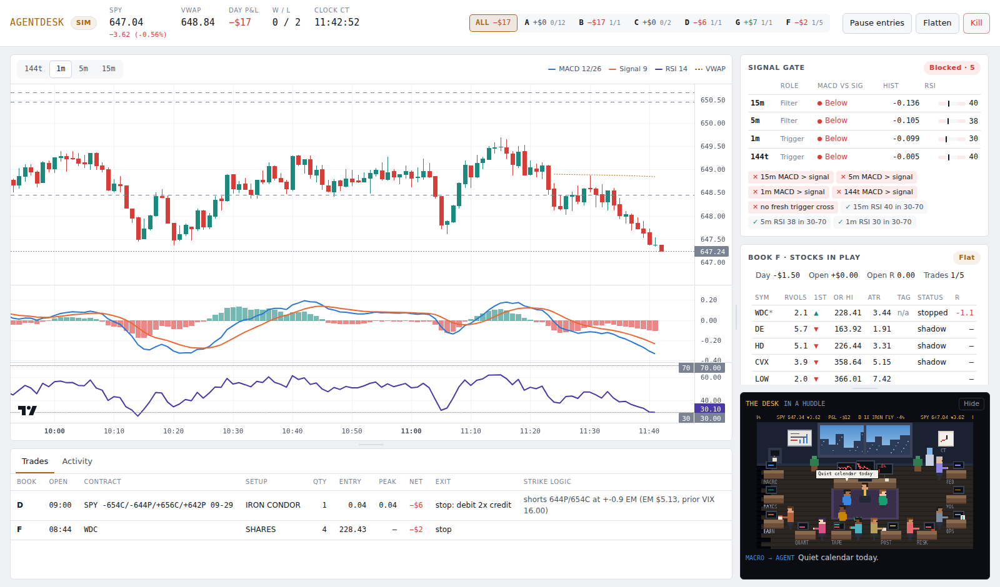

# AgentDesk

[](https://github.com/evanshattenkirk/Trading-Agent/actions/workflows/tests.yml)

An options trading desk for SPY that runs on Robinhood's Agentic Trading MCP. Entries, exits and risk are fixed-rule Python. A research crew of Claude "desks" briefs the engine, argues in roundtables and votes on size, but it can only cut risk or propose changes; it never places an order and can't touch size or loss limits.

**Status:** every strategy book runs on paper. Nothing trades live. A book reaches real money only through the promotion ladder below, one book at a time, at one contract.



## Background

Before writing this bot, I spent seven years trading my own taxable Robinhood account with a discretionary value-and-options approach. From May 2019 to Sep 2026 (88 months) that account ran on a nearly fixed capital base. Later savings went to Roth accounts, so this account compounded on its own.

- **9.21x** on invested capital ($10.4k in, $95.8k withdrawn or held), **43.86%** XIRR
- Time-weighted return **52.88%** a year vs **15.15%** for the S&P 500 price index
- Sharpe **1.02**, Sortino **2.41**, information ratio **0.88**; beta **1.78**, alpha about **+28%** a year vs SPY total return
- Max drawdown **−49.75%** (Sep 2022); margin used in 68 of 88 months
- One top-up in Aug 2022, about **5%** of total capital, added a month before that trough

This is the account where I take concentrated risk on purpose; retirement accounts are funded separately at lower risk. AgentDesk is my attempt to translate that playbook into explicit rules an agent can run, under limits the discretionary account never had: a $400 daily loss limit, a $1,500 cap on open risk, and paper trading until a book earns promotion. The translation is still being tested. The first out-of-sample tests of the MACD rules aren't statistically significant yet (see `research/`), which is why every book stays in paper.

*Figures are self-reported from broker statements and not audited. Nothing here is investment advice.*

## What's worth a look

- **An LLM with bounded authority.** Claude desks (Macro, Vol, Quant, Risk, Tape and others) brief before the open and during the day, then vote size 0.5–1.25×. Any vote below 1 cuts size at once. A size-up needs every item on a checklist to pass. Tweaks apply automatically only for whitelisted parameters inside hard bounds; standing changes and new strategies wait for a human to approve them. `agentdesk/crew.py`, `agentdesk/proposals.py`
- **A deterministic core.** Signals, strikes, exits and risk are plain Python rules (`strategy.py`, `strikes.py`, `exits.py`, `risk.py`). The same engine runs the simulator, backtests, paper, shadow and live; only the feed and the broker change.
- **Broker integration over MCP.** Orders are built from the tool schemas Robinhood's MCP server reports. Shadow mode sends every order to `review_option_order` without placing it. Each `place_option_order` carries an idempotency `ref_id`, and a client-side call budget keeps the engine under Robinhood's rate limit. `agentdesk/brokers/robinhood.py`
- **Safety you can test.** A daily loss limit that counts open P&L at the bid, per-book halts, a stale-quote watchdog, day risk state that survives restarts, every position sold on Ctrl-C, and dashboard controls behind a per-run token with Origin and Host checks. `risk.py`, `lifecycle.py`, `server.py`
- **Research that reports its failures.** Rules are pre-registered before results, split in-sample and out-of-sample, and re-run at taker fills. Most candidates fail, and the write-ups say so. `research/`
- **Cost-aware model use.** Prompt-cache breakpoints on every Claude call, about 3 web-search calls a day, and a per-desk tally of tokens and estimated cost.
- **525 tests**, including a real `run --mode sim` subprocess shut down by signal and full simulated days across every book. `tests/`

## Strategy books

All books run side by side on one paper account: $10,000 balance, $1,500 cap on open risk, $0.04 fee per option leg.

| Book | What it trades | Status | Evidence so far |
|---|---|---|---|
| **A** | Evan's MACD 0DTE calls: 15m and 5m MACD above signal as the filter, 1m or 144-tick cross-up as the trigger, RSI 30–70 | Paper; the only book allowed to go live | The MACD proxy isn't significant out of sample (t 0.23 / 1.69 / 0.39). Results on the free IEX feed aren't evidence, so A is judged by a weekly replay on full SIP prints |
| **B** | 0DTE SPY iron fly at 08:45 CT, $5 wings, take profit 50% | Paper | Relies on the variance risk premium, modeled from VIX. Real-quote replay: `research/bd_real_quotes.py` |
| **C** | Bullish 30-minute opening-range breakout → $2 bull-put spread | Paper | Negative in backtest (−3 bp a trade, t −5.75 in-sample). Kept on paper to confirm |
| **D** | 10:00 ET iron condor, shorts at 0.9× the expected move, quiet-day filter | Paper | Modeled positive at taker fills with the entry-time filter; turns mixed (0.0% / −3.7% / +4.1% across three periods) if implied vol is 40% below the model (`research/d_quiet_check.py`) |
| **E** | Pre-earnings IV run-up: ATM straddle at T−3, call calendar at T−10, always sold before the report | Paper; holds positions across days | No quote backtest yet |
| **F** | Large-cap stocks in play: opening-range breakout on high relative volume, long shares | Paper, logging only | Replication 2016–2026 fails: PF 0.66, t −10.5 (`research/strategy_f_intraday.md`) |
| **G** | 0DTE/1DTE SPY ATM call calendar at 09:00 CT | Paper | The only one of seven pre-registered candidates to pass (modeled). Needs a real-quote replay before promotion |

A bearish-puts mirror of C is built but disabled until a pre-registered filter passes out of sample.

## Architecture

```
 SPY prints (Alpaca IEX / SIP) ──► bars: 144t · 1m · 5m · 15m ──► MACD(12,26,9) + RSI(14)
                                                                       │
 Research crew (Claude + web search) ──► size cap / blackouts ──► Risk manager ◄── daily limits, cooldowns
                                                                       │
                                   strike picker (time of day + levels) ──► order: review ─► place
                                                                       │            (Robinhood MCP)
                                             exit plan: stop / scale / trail / cross-back / flatten
```

Books B–G run from one-line hooks in the engine through `books/host.py`, `books/e_host.py` and `books/f_host.py`, which share one risk account. The dashboard is a FastAPI app that streams engine events over a websocket.

**Stack:** Python 3.11, asyncio, FastAPI, uvicorn and websockets, httpx, pandas and numpy, the `mcp` client, the Anthropic SDK (Claude Sonnet for desk briefs, Haiku for notes and roundtables, with web search), SQLite for the journal, vanilla JavaScript with TradingView Lightweight Charts and a canvas pixel office, and pytest. Data: Alpaca (IEX, or SIP on the paid plan), Robinhood MCP for option quotes and Level 2, and ThetaData for historical option quotes in research.

## Quick start (simulator, no keys)

```bash
python3 -m venv .venv && source .venv/bin/activate
pip install -r requirements.txt
python -m agentdesk run --mode sim      # opens http://127.0.0.1:8765/#token=..., synthetic day at 30x speed (config default is paper)
python -m agentdesk run --mode sim --speed 120
python -m pytest -q tests               # full suite, about 2 minutes
```

## Going live: the ladder

Each rung uses the same engine and only swaps the data feed and the broker.

1. **Simulator** – `python -m agentdesk run`. Tests the plumbing only. It says nothing about edge.
2. **Backtest on real SPY** – put Alpaca keys in `.env`:
   - `python -m agentdesk backtest --days 60` runs on 1m bars. This tests the 15m/5m filter, the 1m trigger and the SWING exits. You can't build 144t bars from 1m data.
   - `python -m agentdesk backtest --days 5 --ticks` downloads every print and runs the full spec, including 144t and SCALP. It's heavy: about 1M prints a day on SIP. Downloads are cached in `~/.agentdesk/cache`.
   - `--source robinhood` pulls SPY 1-minute bars from the Robinhood connection instead of Alpaca. No data key is needed.
   - Option P&L defaults to Black-Scholes on the replayed spot (`--iv 0.16`). `--options alpaca` uses real option bars instead. Read `backtest/summary.json`: expectancy, profit factor, max drawdown, and results by setup, hour and exit reason. **Don't go past step 3 unless expectancy is positive after the fees and slippage modeled here.**
3. **Connect Robinhood** – on a desktop, run `python -m agentdesk rh-inspect`.
   - It opens Robinhood's OAuth page. Approve it and create the Agentic account when prompted.
   - It then prints every tool's schema to `rh_tools.json`, finds the Agentic account, quotes today's first OTM SPY call, and calls `review_option_order` on it. That call is a simulation; nothing is placed.
   - If any required field isn't mapped, the error names it. Pin it in `robinhood.arg_overrides`.
4. **Paper** – `python -m agentdesk run --mode paper`. Real SPY feed and real Robinhood option quotes, simulated fills. Run it for 2 weeks.
5. **Shadow** – `--mode shadow`. Every order is fully built and sent to Robinhood's `review_option_order`, but fills are still simulated. This proves the order path end to end.
6. **Live** – set `live_enabled: true` and `sizing.max_contracts: 1`, then run `--mode live`. Raise size only after 20+ live trades that track the paper results. Only one book can be promoted, and the owner decides.

## Book A's rules, as the engine runs them

| Rule | What the engine does | Config |
|---|---|---|
| 15m + 5m are the filter | Both MACD lines above signal on the live candle | `strategy.filter_timeframes` |
| 1m + 144t are the triggers | Both above signal on the last closed bar, and one of them crossed up within 120s. A fresh 1m cross makes a **SWING**; a 144t-only cross makes a **SCALP** | `strategy.trigger_timeframes`, `confirm_window_sec` |
| RSI 14, 30 / 70 | RSI inside 30–70 on 15m, 5m, 1m. Oversold is blocked too, so it doesn't catch falling knives | `strategy.rsi` |
| 1 OTM, 2 OTM early if levels allow, ITM late | 08:30 +1 (up to +2 if the next resistance clears the +2 strike), 10:30 +1, 12:30 ATM, 13:45 1 ITM. Steps in a strike if PDH / ORH / VWAP / a 5m pivot caps the strike | `strikes.schedule` |
| 4–5 contracts, $300–500 | `floor($500 / ask)`, capped at 5 contracts | `sizing` |
| Stop around 20% | Hard stop at −20% of premium (on mark; exits at the bid) | `exits.stop_loss_pct` |
| Take profit, let some ride | SWING: sell 50% at +25% and 25% at +50%, stop to breakeven, runner trails 25% off peak. SCALP: 50% at +15%, runner trails 15% | `exits.swing`, `exits.scalp` |
| Exit on MACD cross back | Before any scale-out, a cross back on the setup's timeframe (1m SWING / 144t SCALP) exits everything. After one, it exits the runner | `exit_on_cross_back` |
| "When it's ripping" | If the 5m histogram is rising and price is above VWAP, the runner ignores the 1m cross back and waits for a 5m cross back (the trail still protects it) | `ripping_hold` |
| Not held overnight | No entries after 14:30. Everything is flattened at 14:40 CT, and 5 minutes before each contract's Robinhood sellout time (14:45 CT for SPY 0DTE). Half-days: entries stop 11:20, flatten 11:40 | `strategy.entry_window`, `exits.flatten_at`, `calendar.early_close` |

Risk limits: −$400 daily loss halts trading. After +$600, giving back 40% of the peak halts trading. 12 trades a day max, one position at a time. Two straight losses start a 15-minute cooldown. No entries from 10 minutes before to 20 minutes after a high-impact event, and positions go flat 5 minutes before one. The dashboard can also pause, flatten, or kill. The loss limit counts open positions at the bid: once realized plus open P&L reaches −$400 the engine halts and flattens.

The day's P&L, trade count, cooldown, pause and any halt (kill switch, safety halt, loss limit) are saved in `~/.agentdesk/risk_state_<mode>.json`, so restarting the engine the same day doesn't reset them. `run --clear-halt` lifts a saved halt; the P&L and limits still apply.

The dashboard controls (pause, flatten, kill, approve) need the link printed in the terminal, which carries a new token each run (or set `AGENTDESK_TOKEN` in `.env`). Ctrl-C or SIGTERM first sells every open position (book A and the paper books, up to 8 s), then stops the engine within a few seconds; anything still open after that is logged. A second Ctrl-C exits at once without selling. Book E's multi-day positions are the exception: they're saved and restored, not sold at shutdown.

## Robinhood account prerequisites

- Options must be approved **on the Agentic account itself** (options levels are per account). The Agentic account used here was approved for Level 3 on 2026-09-27, which allows spreads; `review_option_order` accepted a 2-leg credit spread. Shadow and live modes refuse to start if the level is missing.
- Live mode also requires `robinhood.account_number` in `config.yaml`. The engine never picks an account to trade on its own.

## Keys (`.env`)

```
ALPACA_API_KEY_ID=...        # data. Algo Trader Plus ($99/mo) = full SIP + OPRA. Free = IEX only (144t bars form far slower)
ALPACA_API_SECRET_KEY=...
MASSIVE_API_KEY=...          # alternative data vendor (formerly Polygon.io); set data.provider: massive
ANTHROPIC_API_KEY=...        # research crew with web search; without it, crew runs offline from config.events
```

Robinhood auth is OAuth. Tokens are cached at `~/.agentdesk/rh_oauth.json` with mode 0600. No password is stored.

## The research crew

| Desk | Huddles | Brings |
|---|---|---|
| Macro | 08:15 catch-up, 08:25 huddle, 11:30 | Econ calendar, data surprises, blackouts around CPI / NFP / ISM; also the rates and Fed read |
| Rates | 08:15 catch-up, 08:25 huddle, 11:30 | 2Y / 10Y moves, curve, auctions (from Macro's research) |
| Fed Watch | 08:15 catch-up, 08:25 huddle, 13:15 | FOMC timing, Fed speakers (from Macro's research) |
| Vol | 08:15 catch-up, 08:25 huddle, 11:30, 13:15, 15:05 | VIX from Robinhood, expected move from the recorded 0DTE straddle, one premarket web check for VIX1D |
| Quant | after 2 straight losses, 15:05 | Our own stats; per-day and standing tweaks |
| Risk | loss reviews, halts | Reports the deterministic risk manager |
| Tape | loss reviews, big walls | Level 2 book read |
| Ops | 08:15 catch-up, 08:25 huddle, halts | Pre-flight checklist: paper mode, limits and watchdog armed, data and broker up, recorder landed |
| Earnings | 08:15 catch-up, 08:25 huddle | Earnings calendar: book E's windows, SPY heavyweights reporting overnight |
| Post-mortem | 15:05 | Audits the day's trades against the rules; writes a daily file |

Rates and Fed Watch are information-only: they come from Macro's single web call and hold a fixed 1.0 vote. Ops, Earnings and Post-mortem are restrict-only: they can cut size (Ops, when signal history is short) but never raise it, pitch changes or add blackouts. Each desk's vote reaches only the books its topic affects (`crew.vote_books`).

**Roundtables.** In each huddle the desks brief, then talk to each other: Vol prices Fed risk, Risk grills Quant after losses. Only desks in that huddle can revise their votes after hearing the others. With an Anthropic key, this is one extra model call per huddle. Offline, it's templated from the briefs.

**Size votes.** Each desk votes 0.5–1.25×.
- Any vote below 1.0 cuts size right away, and the lowest vote wins.
- A size-up (up to 125%, which also lifts the contract cap from 5 to 6) only happens on a book A **SWING** entry when **every** check passes:
  - Macro and Vol each vote above 1.0 with confidence ≥ 0.6.
  - Fed isn't hawkish.
  - No desk votes down.
  - No high-impact event in the next 60 minutes.
  - SPY is above VWAP.
  - The 15m MACD histogram is rising.
  - Level 2 isn't leaning against the trade.
  - The day is green with no loss streak.
  - It's before 13:30 CT.

  The dashboard shows the checklist on every entry.

**Proposals.** Desks can pitch changes:
- *Next trade* or *today* tweaks apply automatically, but only to whitelisted parameters inside hard bounds. Examples: stop 10–25%, trail, first target, RSI ceiling, an earlier cutoff, fewer trades, skipping a setup, capping strike distance. Size and the loss limits are not on the list. Today's tweaks revert at the next session.
- *Standing changes* wait for the owner's **Approve** in the dashboard. Once approved, they're written to `overrides.yaml`.
- *New strategies* arrive as written rules plus evidence. Approving one queues it to be built and backtested; nothing new trades by itself.

Briefs, trades, Level 2 snapshots, proposals and the crew's effect on each trade are all logged under `~/.agentdesk/`.

## Level 2

The engine polls Robinhood's `get_equity_price_book` for SPY every 3 seconds. On each snapshot it computes:
- near-book imbalance
- microprice vs mid
- walls (levels at least 4× the median size and at least 10k shares)

**Default mode is `observe`.** Every entry logs the book state and whether it *would* have blocked the trade, but nothing is blocked. There's no historical Level 2 to backtest against. After a few weeks of paper or live trades, run `python -m agentdesk l2-report` to see win rate by book state. Flip `l2.mode` to `enforce` only if the numbers support it.

## Real option quotes, recorded forward

Robinhood's intraday history for past 0DTE contracts comes back gap-filled, so it can't be used for option P&L. The quote recorder (standalone, or inside the engine) therefore saves real 0DTE quotes (calls and puts, ATM−10 through ATM+10) every 10 seconds into `journal.option_quotes`. A few weeks of that settles naked calls vs debit spreads, and the iron fly / condor credits, on real prices.

## Paper option books B, C, D and G

Books B (iron fly), C (ORB bull-put), D (iron condor) and G (call calendar) run next to book A in every mode, always on paper: fills are simulated at mid minus 1¢ per leg (never worse than the natural price) and each fill logs both. In shadow mode the first price of each order also goes to `review_option_order`; nothing is ever placed. Settings live under `books:` in `config.yaml` (`paper_only: true` is required).

- Account: $10,000 paper balance, $1,500 cap on the sum of open max losses (book A's open debit counts), $300 max loss per B/C/D position, C sized from a $400 budget (the lower wins).
- Each book has its own trades, P&L and halt. A book that keeps erroring halts and flattens itself; the kill switch, safety halts and the 14:40 CT flatten cover every book.
- The journal's `trades` table has a `book` column (A–G) plus `legs` and `max_loss`.
- Dashboard: the chips next to the header stats switch between ALL and each book. The Day P&L, the position card (legs, credit, mark, take profit, stop, max loss) and the trades table follow the selection.

## Book E: pre-earnings IV run-up (paper)

Book E buys the implied-volatility run-up into an earnings report and always sells before the report comes out. It is a paper experiment: fills are simulated on E's own paper broker (mid minus 1¢ per leg, never worse than natural), and `paper_only: true` is required.

- **E1 straddle:** at T−3, buy the ATM call and put in the first expiry after the report (4–10 DTE). Take profit +20%, stop −30%.
- **E2 calendar:** at T−10..T−8, sell the ATM call expiring before the report and buy the same strike expiring after it. Take profit +15%, stop −30%. It also exits by 14:15 CT on the day its short leg expires.
- Entries and exits happen at 14:45 CT (11:20 on half-days). The exit is the close before the report: T−1, or T−0 for after-close reporters.
- Limits: $500 max debit for E1, $250 for E2, at most 3 positions, one per sector and one per name, prior VIX close at or below 30, every leg's spread within 5% of mid. After four earnings cycles of `iv_history`, E also skips names whose IV sits above the 80th percentile of earlier cycles.
- E holds for days, so its positions live in `e_positions`, are restored when the engine starts, and are **not** sold at shutdown. The kill switch, safety halts, an E halt and the dashboard's Flatten button still sell them.
- The IV data comes from the standalone quote recorder: from 13:30 CT it lists strikes (≤ 0.5 calls/s), and from 14:50 CT it records the ATM IV per name (≤ 1 call/s) into `journal.iv_history`. `python -m agentdesk iv-snapshot` runs that pass once by hand.
- The paper session and the recorder run as launchd jobs from pinned copies of the code; after updating, redeploy both with `tools/install_recorder.sh && tools/install_paper.sh`.

## Book F: stocks in play (paper)

Long whole shares on a 5-minute opening-range breakout in large caps with high relative volume. The brief is `docs/BOOK_F_HANDOFF.md`. `python -m agentdesk f-report` shows its paper record, and `research/strategy_f_intraday.py` is its replication backtest (a fail; F runs only as a logging experiment).

## Things to know before real money

- **Stops live in this process, not at Robinhood.** If the host machine sleeps or loses its connection, open positions are unmanaged. Run it on a machine that stays awake (`caffeinate -dims python -m agentdesk run --mode live`). On startup, the engine refuses to trade if the Agentic account already holds option positions.
- **Robinhood hasn't published rate limits.** The account throttles near 240 calls a minute; the engine keeps to a budget of 120 a minute and backs off on a rate-limit reply. Entries and exits are marketable limit orders with up to 2 reprices. Each `place_option_order` carries an idempotency `ref_id`, so a retry can't double-fill.
- **Robinhood frames Agentic Trading around AI agents.** Here, a Python process places the orders, with Claude supervising. Confirm that fits their terms before running live.
- **Tick charts depend on the feed.** 144 prints on a consolidated SIP feed form in seconds. On the free IEX feed (about 3.7% of SPY prints) the engine uses 5 IEX prints as the 144t approximation (`strategy.tick_bar_size_iex`), so SCALP is only approximate until the feed is upgraded to SIP.

## Layout

```
agentdesk/   engine.py strategy.py indicators.py bars.py strikes.py levels.py exits.py risk.py lifecycle.py
             crew.py desks.py proposals.py      research crew (Claude) and its proposal book
             server.py web/                     FastAPI + websocket dashboard and the pixel office
             brokers/   paper, robinhood (options), paper_equity, robinhood_equity
             feeds/     sim, alpaca, massive, prints (bad-print filter), f_data
             books/     host, account, group, fills, plus one module per book (iron_fly, orb_bull_put,
                        iron_condor, call_calendar, e_host / earnings_iv, f_host / f_stocks_in_play)
             recorder.py iv_recorder.py l2.py backtest.py journal.py
reporting/   weekly_quant.py: per-book weekly report and promotion gates
research/    pre-registered strategy studies, real-quote replays, IEX vs SIP comparison (research/README.md)
tests/       pytest suite
tools/       build_demo.py, launchd installers for the paper session and the quote recorder
docs/        design specs and implementation plans (docs/superpowers/), the book F brief
```

## Built with Claude Code

The design and first build happened in claude.ai sessions on 2026-09-27; every change since went through Claude Code (first commit 2026-09-28). The repo keeps the working trail:
- `CLAUDE.md` is the standing brief the coding agent reads first.
- `HANDOFF.md` is the original build record (v3, 2026-09-27) with the rules, backtests and phased plan.
- `docs/superpowers/` holds the design spec and implementation plan each larger feature went through before code: spec, approval, plan, then tests first.

## License and disclaimer

Source available for review. All rights reserved; no license is granted to copy or reuse the code. Nothing in this repository is investment advice.
